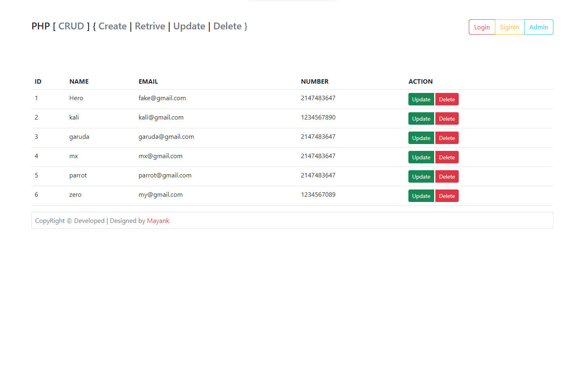

# PHP_CRUD

- Name : "PHP_CRUD"

- Description : "Learn to Understand PHP (Create|Retrive|Update|Delete) CRUD system"

- Version : 1.5

- Update : 12-10-2023

- Status : Active

- Responsive : False

- TecStack : { HTML | CSS | JavaScript | Bootstrap | PHP | Database }

- Thanks : { VSCode | GitHub | Bootstrap | PHP }

- Work : Self

- Design : { Mayank }

- Developer : { Mayank }

- CopyRight : { ProCoders }

- URL : null 

- Clone : https://github.com/MayankDevil/website-7.git

- Download : https://github.com/MayankDevil/website-7/archive/refs/heads/main.zip

---

### Web Page

## Feature

-   Full Stack Web Application

-   Simple Understandable for execution

-   Component Basic Architecture

-   Secureity Set Struture

-   Easy To Update

-   Delete data is Erase

### Theme Mode

_Simple Bootstrap color theme combination with plain white background._

### Requirement

1-   __Database__   this require database like _sql_ & _phpMyAdmin_ etc.

2-    __backend/connection.php__ set configration.

